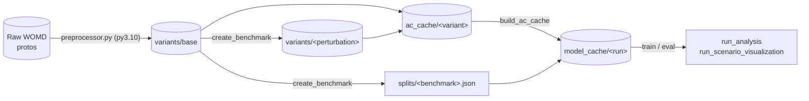

# Dataset Preparation

This document covers how to **download the raw data** and build the **`base` variant**, plus the per-dataset label prep (Causal Agents, SafeShift) that the benchmark tooling needs. How the data is is split into train/val/test, how perturbed variants are generated, and how the agent-centric cache is built are owned by **[BENCHMARKS.md](BENCHMARKS.md)**.

## Environments

The pipeline uses **two Python environments**. Only the raw Waymo proto decode (and the CausalAgents label scripts) need Python 3.10; everything else runs in the main Python 3.12 environment.

| Environment | Python | Install | Used for |
|---|---|---|---|
| **Main** | 3.12 | `uv sync` (or `uv run pip install -e .`) | `create_benchmark`, `build_ac_cache`, `train`, `eval`, visualization |
| **Decoder** | 3.10 | `uv venv .venv-waymo --python 3.10` then `uv pip install waymo-open-dataset-tf-2-12-0 numpy tqdm` | decoding raw Waymo protos, CausalAgents label scripts |

The decoder must be **separate and minimal**: `waymo-open-dataset-tf-2-12-0` pins **tensorflow 2.12**, which conflicts with the project's core **tensorflow 2.19**, so the full project cannot be installed alongside it. [`preprocessor.py`](../src/controlledshifts/datasets/waymo/preprocessor.py) is self-contained (no `controlledshifts` imports), so run it **by file path** with the decoder env's `python` — not `python -m controlledshifts...`, which would require the conflicting full project in the 3.10 env.

## Data layout

A single canonical copy of each *truly different* dataset is kept and re-split logically — scenarios are never copied per benchmark:

- `variants/<variant>/<scenario_id>.pkl`: `base` is the unperturbed data variant; each causal perturbation (`remove_causal`, `remove_noncausal`, `remove_noncausalequal`, `remove_static`) is its own variant.
- `splits/<benchmark>.json` — each benchmark's `{training, validation, testing}` lists of scenario IDs (no data is copied).
- `ac_cache/<variant>/<profile_hash>/` — the model-ready agent-centric tensors for a variant, built once per processing profile.

See **[BENCHMARKS.md](BENCHMARKS.md)** for how splits, perturbed variants, and caches are produced and keyed.

---

## Pipeline



Each step below is tagged with the environment it runs in (`[3.12]` / `[3.10]`).

1. **`[3.12]` Install the main environment** — see *Installation* in the [README](../README.md).

2. **`[3.10]` Create the decoder environment:**
   ```bash
   uv venv .venv-waymo --python 3.10
   uv pip install waymo-open-dataset-tf-2-12-0 numpy tqdm
   ```

3. **`[3.10]` Download the raw Waymo data** ([gcloud CLI](https://cloud.google.com/sdk/docs/install#deb), [dataset docs](https://scenarionet.readthedocs.io/en/latest/waymo.html#install-requirements)):
   ```bash
   mkdir -p /datasets/waymo/raw/scenario
   cd /datasets/waymo/raw/scenario
   gcloud init
   gsutil -m cp -r "gs://waymo_open_dataset_motion_v_1_2_0/uncompressed/scenario/training" .
   gsutil -m cp -r "gs://waymo_open_dataset_motion_v_1_2_0/uncompressed/scenario/validation" .
   gsutil -m cp -r "gs://waymo_open_dataset_motion_v_1_2_0/uncompressed/scenario/testing" .
   ```

   **[Optional] Sample a mini subset** — randomly selects 15% of the training files into `/datasets/waymo/raw/mini`:
   ```bash
   cd ControlledShifts/src/scripts
   uv run waymo_data_selection.py --parallel
   ```
   If disk space is tight, delete the original splits afterwards (`rm -rf /datasets/waymo/raw/scenario/*`).

4. **`[3.10]` Decode into the canonical `base` variant store.** Run once per raw Waymo split. `--split` selects which raw download directory to read (`training`/`validation`/`testing`) — it is **not** benchmark splitting: the output is always flat (one decoded scenario dict per `scenario_id`), and train/val/test lives in `splits/*.json`. The raw origin split of each scenario is recorded in `variants/base/_variant_manifest.json` for provenance only.
   ```bash
   # in the activated Python 3.10 decoder env, from the repo root
   python src/controlledshifts/datasets/waymo/preprocessor.py --raw_data_path /data/driving/waymo/raw/mini --proc_data_path /data/driving/waymo/variants/base --split training
   python src/controlledshifts/datasets/waymo/preprocessor.py --raw_data_path /data/driving/waymo/raw/mini --proc_data_path /data/driving/waymo/variants/base --split validation
   python src/controlledshifts/datasets/waymo/preprocessor.py --raw_data_path /data/driving/waymo/raw/mini --proc_data_path /data/driving/waymo/variants/base --split testing
   ```
   > [!IMPORTANT]
   > Training defaults expect data under `/data/driving` (see [`default.yaml`](../src/controlledshifts/configs/paths/default.yaml)); adjust `base_path` to match your data location.

5. **`[3.12]` Create a benchmark and build the agent-centric cache.** A benchmark partitions `variants/base` into train/val/test (and, for shift benchmarks, generates perturbed variants); `build_ac_cache` then turns a variant into model-ready tensors. There are **six** benchmarks — see **[BENCHMARKS.md](BENCHMARKS.md)** for the full list, options, and which processing profiles share a cache.
   ```bash
   uv run -m controlledshifts.create_benchmark benchmark=uniform
   uv run -m controlledshifts.build_ac_cache variant=base model=autobot
   ```

6. **`[3.12]` Train / evaluate** — reads records straight from `ac_cache/<variant>/<profile_hash>/`, selected by the split JSON, with no reprocessing or copying. See **[MODEL_TRAINING.md](MODEL_TRAINING.md)**.
   ```bash
   uv run -m controlledshifts.train model=autobot paths=uniform
   ```

---

## Per-dataset prerequisites

The pipeline above is the common path. The benchmarks below need extra download/label work first; once it is done, run the same pipeline (decode → `create_benchmark` → `build_ac_cache`).

### Causal Agents (WOMD)

Prepares the per-scenario causal labels that the `causal_agents` benchmark consumes. **Most steps require Python 3.10** (they depend on `waymo_open_dataset`).

1. Download [CausalAgents](https://github.com/google-research/causal-agents) labels:
   ```bash
   mkdir -p /datasets/waymo/causal_agents
   cd /datasets/waymo/causal_agents
   gsutil cp -r "gs://waymo_open_dataset_causal_agents/cusal_labels.tfrecord" .
   ```

2. Install `protobuf`, then fetch the [causal labels proto](https://github.com/google-research/causal-agents/blob/main/protos/causal_labels.proto) and compile it:
   ```bash
   cd ControlledShifts/src/scripts
   protoc --python_out=. causal_agents.proto
   ```

3. Process the labels into a protobuf-independent format (writes a summary to `meta/summary.json`):
   ```bash
   uv run process_causal_agents_labels.py
   ```

4. **[Optional sanity checks]:**
   ```bash
   # Cross-match label scenario_ids against the original validation set -> meta/validation_records.json
   uv run find_causal_agent_scenarios.py
   # After decoding (step 4 of the pipeline), verify causal agent IDs exist in the processed data
   uv run verify_agent_ids.py
   ```

5. Run the pipeline: select the labeled validation scenes, decode them into `base`, then create the benchmark. The `causal_agents` benchmark reuses `splits/uniform.json` and writes the four perturbed variant stores (`remove_causal`, `remove_noncausal`, `remove_noncausalequal`, `remove_static`). See **[BENCHMARKS.md](BENCHMARKS.md)** for variant details.
   ```bash
   uv run waymo_data_selection.py --parallel --input_data_path /datasets/waymo/raw/scenario/validation --output_dir mini_causal --percentage 1.0
   # decode /data/driving/waymo/raw/mini_causal into variants/base (pipeline step 4)
   uv run -m controlledshifts.create_benchmark benchmark=uniform        # if not already created
   uv run -m controlledshifts.create_benchmark benchmark=causal_agents
   uv run -m controlledshifts.build_ac_cache variant=remove_noncausal model=autobot
   ```

<details>
<summary><b>SafeShift (WOMD)</b> — not used in this project, kept for reference.</summary>

1. Download the processed splits from [Box](https://cmu.app.box.com/s/ptl5vlsi5uwt6drejnrpcp8a9utfwuzo) (`mtr_process_splits.zip`, the SafeShift scoring splits) and unzip into `/datasets/`.

2. Download the Waymo **training** and **validation** sets (only these are needed) if not already present:
   ```bash
   cd /datasets/waymo/raw/scenario
   gsutil -m cp -r "gs://waymo_open_dataset_motion_v_1_2_0/uncompressed/scenario/training" .
   gsutil -m cp -r "gs://waymo_open_dataset_motion_v_1_2_0/uncompressed/scenario/validation" .
   ```

3. Decode only the SafeShift scenarios (`--search_safeshift` filters to the IDs in the SafeShift split metadata). Check `mtr_process_splits` for other allowed `--safeshift_prefix` values:
   ```bash
   python src/controlledshifts/datasets/waymo/preprocessor.py --raw_data_path /datasets/waymo/raw/scenario --proc_data_path /datasets/safeshift_all --search_safeshift --safeshift_data_splits_path /datasets/mtr_process_splits --safeshift_prefix score_asym_combined_80_ --split training
   python src/controlledshifts/datasets/waymo/preprocessor.py --raw_data_path /datasets/waymo/raw/scenario --proc_data_path /datasets/safeshift_all --search_safeshift --safeshift_data_splits_path /datasets/mtr_process_splits --safeshift_prefix score_asym_combined_80_ --split validation
   ```

4. Re-split into a safety-critical ID/OOD benchmark via `create_benchmark benchmark=safeshift` (or `ego_safeshift`). See **[BENCHMARKS.md](BENCHMARKS.md)** for its options.

</details>
